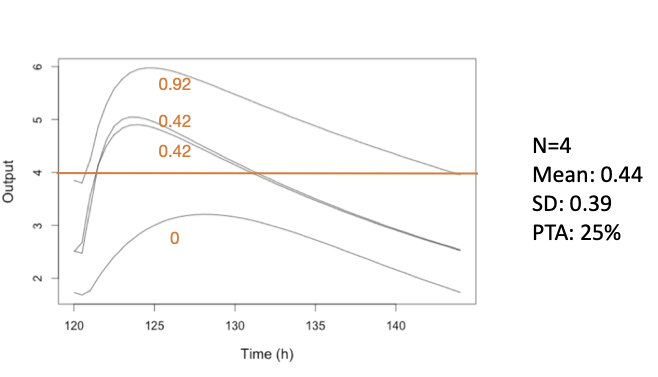
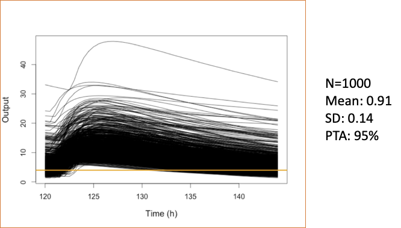

```{r}
#| label: setup
#| echo: false
#| message: false
#| eval: true
library(glue)
library(knitr)
library(Pmetrics)


knitr::opts_chunk$set(
  collapse = TRUE,
  comment = "#>", 
  echo = TRUE,
  eval = FALSE
)


pmetrics <- function(){
    knitr::asis_output("[Pmetrics]{style=\"color: #841010; font-family: 'Arial', Arial, sans-serif; font-weight: 900;\"}")
}


r_help <- function(pkg, name, fn = NULL) {
    if(is.null(fn)) {fn <- name}
    glue::glue("[`{name}`](https://rdrr.io/pkg/{pkg}/man/{fn}.html)")
}

gh_help <- function(name) {
    glue::glue("[`{name}`](https://lapkb.github.io/Pmetrics/reference/{name}.html)")
}


run1 <- PM_load(run = 1, path = "Data/Runs")
run2 <- PM_load(run = 2, path = "Data/Runs")

```

::: {.callout-tip} 
It is essential that you understand [simulations](simulation.qmd) first. 

Also, make sure you have run the [tutorial setup code](index.qmd#tutorial-setup) in your R session before copying, pasting and running example code here.
:::

## Introduction

Probability of Target Attainment (PTA) analysis is a common method to evaluate
the likelihood that a dosing regimen will achieve a specified pharmacodynamic index
(e.g., %T>MIC, AUC:MIC, Cmax:MIC, Cmin:MIC) for a range of targets, in this case minimum inhibitory concentrations (MICs). PTA is often used in drug development for dosing optimization.

The steps to perform PTA analysis using `r pmetrics()` are:

1. Simulate concentration-time profiles for various dosing regimens using a previously fitted model.
2. Define pharmacodynamic target(s) and success criteria.
3. Calculate the probability of target attainment (success) for each dosing regimen across the target(s).

Here's an illustration. Suppose our target is %T>MIC of at least 60% over a dosing interval of 24 hours, with an MIC of 4.

{width=50%, height=50%, fig-align="center"}

Of the 4 simulated profiles, only the highest remains above 4 for at least 60% of the interval (14.4 hours), so the PTA at this MIC for this regimen is 1/4 = 25%. The mean pharmacodynamic index (PDI) is 44% T>MIC across all 4 profiles, with a standard deviation of 39%.

:::{.callout-tip}
The **usual acceptance criterion** to consider a regimen successful is a PTA of at least 80% or 90%.
:::

Of course, we don't usually simulate only 4 profiles; 1000 or more is typical, as shown in the expanded figure below.

{width=50%, height=50%, fig-align="center"}

Now, 95% of the profiles are above the target for at least 60% of the interval; the mean PDI is 91% T>MIC with a standard deviation of 14%. 

:::{.callout-note}
## MIPD vs. PTA
It should be noted that Bayesian Model-Informed Personalized Dosing (MIPD) methods provide a more precise and personalized approach to dosing optimization, even for the first dose, compared to population-based PTA analysis.

Nevertheless, PTA is *extremely* useful during the drug development process to guide dose selection for clinical trials, to inform dosing recommendations in drug labeling, to support regulatory submissions, and to optimize dosing in populations where individual concentration data is not readily available.
:::

## PTA creation

There are two ways of creating a `r gh_help("PM_pta")` object in `r pmetrics()`.


1.   **PM_sim$pta()** This way is directly from a previously created `r gh_help("PM_sim")` object.

:::{code-copy='false'}
```{r}
# do not execute; for illustration of syntax only
# ... are arguments to either PM_result$sim() or PM_sim$pta()
sim1 <- run1$sim(...) # sim1 is a PM_sim object made from run1, a PM_result
pta1 <- sim1$pta(...) # pta1 is a PM_pta object made from sim1
```
:::

2.    **PM_pta$new()** This way is identical to the one above, but the `PM_sim` object is specified as the first argument. 

:::{code-copy='false'}
```{r}
# do not execute; for illustration of syntax only
# ... are arguments to either PM_result$sim() or PM_pta$new()
sim1 <- run1$sim(...) # sim1 is a PM_sim object made from run1, a PM_result
pta1 <- PM_pta$new(sim1, ...) # pta1 is a PM_pta object 
```
:::

Both methods require the prior creation of a simulation of appropriate regimens.

## PTA options

### Critical parameters

There are three critical arguments to either `PM_sim$pta()` or `PM_pta$new()` to set the **targets**, **target types**, and **success criteria**. By calculating the statistic defined by the target type (e.g. AUC) for each simulated profile relative to the target (e.g. AUC:target) and comparing it to the success threshold (e.g. 100), the proportion of profiles that meet or exceed the success criteria can be determined, yielding the PTA for each regimen and target combination.

It is possible to combine multiple target types and to define success as greater than or less than a threshold metric. For example success could be defined as a percent time > target1 *AND* AUC < target2. Or, success could be defined as trough > target1 *AND* peak < target2. This gives you the ability to cacluate complex PTA that combine efficacy with toxicity or other combinations.

Details on the key arguments are as follows:

*   **target** Defines the PDI target and can be one of several options.

    *   A vector of values, such as Minimum Inhibitory Concentrations (MICs), e.g. `c(0.25, 0.5, 1, 2, 4, 8, 16, 32)`.
    *   A single numerical value, e.g. 10.
    *   A sampled distribution of values using `r gh_help("makePTAtarget")`.
    *   A list of multiple targets combining the above if multiple `target_type`s are used. If so, the first `target` can be a vector, but subsequent targets must be single values to avoid factorial expansion of combinations. 

*   **target_type** A vector of the type for each `target`.  For any, place a minus sign
in front to make the success less than the target ratio, e.g. `target_type = c("min", "-max")` means that success will be if minimum concentration is above the target success ratio, and the maximum concentration is below the target success ratio.

    Available types:

    *   "time" is percent time above `target` within the time range specified by `start` and `end`.
    Use "-time" for percent time below `target`.
    *   "auc" is ratio of area under the curve within the time range to `target`
    *   "peak" or "max" are the ratio of peak or max (synonymous) concentration to `target` within the time range. Use "-max" or "-peak" to make the success less than the target ratio.
    *   "min", is the ratio of minimum concentration to `target` within the time range.
    Use "-min" to make the success less than the target ratio.
    *   A single numeric value, which must correspond to an observation time common to all 'PM_sim' objects in `simdata`, rounded to the nearest hour.  In this case, the target statistic will be the ratio of observation at that time to `target`. This enables testing of a specific timed concentration (e.g. one hour after a dose or C1).  Be sure that the time in the simulated data is used, e.g., 122 after a dose given at 120. As for the other target types, make the number negative
    to make the success less than the target ratio, eg -122.

*   **success** A vector specifying the success statistics, e.g. 0.4 for proportion time (end-start) above target, and/or 100 for max:target.
For example `success = 0.4` or `success = c(0.4, 100)`. 

:::{.callout-warning}
If `target` is a list defining multiple target groups, the length of `target_type` and `success` must be the same as the length of `target`.
:::

### Target, target_type, and success examples

In the examples below, we omit the first `simdata` argument to `PM_pta$new()` and all other arguments to focus on the critical arguments. The code is not meant to be copied as is, but rather to illustrate the syntax for defining multiple targets, target types, and success criteria.

:::{code-copy='false'}       
```{r}
# pta target example 1
pta1 <- PM_pta$new(..., 
          target = list(c(0.25, 0.5, 1, 2, 4, 8, 16, 32), # vector for first target group
                        10, # individual value for second target
                        50), # individual value for third target
          target_type = c("time", "min", "-max"), # three corresponding target types
          success = c(0.6, 1, 1) # success criteria
)

# pta target example 2
pta2 <- PM_pta$new(..., 
          target = makePTAtarget(...), # vector for the only target group
          target_type = "auc", # a single target type    
          success = 100 # success criteria        
)
  
```
:::

In example 1 above, the first `target` is  a vector of values corresponding to the first `target_type` of "time"; the second `target` is a single value of 10 corresponding to the second `target_type` of "min", and the third `target` is a value of 50 corresponding to the third `target_type` of "-max". Success for the first target group will be proportion of time above each target value of at least 0.6; success for the second target group will be minimum concentration above 10; success for the third target group will be maximum concentration less than 50. The intersection of these three success criteria will define overall success for each simulated profile.

In example 2, the auxillary function `r gh_help("makePTAtarget")` is used to create a vector of sampled targets for the only `target_type` of "auc". Success is defined as AUC:target of at least 100.

### Other PTA options

There are a number of other arguments to `PM_sim$pta()` and `PM_pta$new()` to customize the PTA analysis. Some of the more commonly used ones are:

*   **simlabels** A character vector of labels for each simulation regimen in the same
order as in the `PM_sim` object. If not provided, generic labels will be used.
*   **free_fraction** A numeric value between 0 and 1 specifying the free (unbound) drug fraction to use when calculating free drug PDIs such as free AUC:MIC, free Cmax:MIC, etc. Default is 1 (total drug).
*   **start** and **end** Numeric values specifying the time range over which to calculate the PDI. Default is the entire simulation time range.
*   **outeq** An integer specifying the number of the simulated output equation to use. Default is 1.

## Complete PTA examples

### Load prior model fits

We have already created two model fits: one [without covariates](NPAG.qmd#example-mod1_def) and one [with covariates](NPAG_cov.qmd#example-mod2_def).  We will use these to simulate data for PTA analysis. Let's load them now.

```{r}
# load run1 (without covariates) and run2 (with covariates)
run1 <- PM_load(run = 1, path = "Runs")
run2 <- PM_load(run = 2, path = "Runs")
```


### Simulate data for PTA

Now we use the first fit to simulate without covariates (`run1`). We will simulate 4 dosing regimens contained in the example data file *Learn/src/ptaex1.csv*.  The simulation will be from 0 to 5 days (144 hours) with a prediction interval from 120 to 144 hours (the last day) and predictions within that interval every 0.5 hours. We limit the simulated parameters to be a minimum of 0 and a maximum of 3 * the original upper bound, and we set the seed for reproducibility.

```{r}
#| echo: false
#| eval: true
#| label: pta-sim-nocov-exec
#| message: false
# simulate without covariates

simlist1 <- run1$sim(
  limits = c(0, 3), data = "Data/src/ptaex1.csv",
  predInt = c(120, 144, 0.5), seed = rep(-17, 4), quiet = TRUE
)
```

```{r}
#| label: pta-sim-nocov

# simulate without covariates

simlist1 <- run1$sim(
  limits = c(0, 3), data = "src/ptaex1.csv",
  predInt = c(120, 144, 0.5), seed = rep(-17, 4)
)
```

We repeat the simulation but this time with covariates (`run2`).

```{r}
#| echo: false
#| eval: true
#| label: pta-sim-cov-exec
#| message: false
# simulate with covariates

covariate <- list(
  cov = run2$cov,
  mean = list(wt = 50),
  sd = list(wt = 20),
  limits = list(wt = c(10, 70)),
  fix = c("africa", "gender", "height")
)

simlist2 <- run2$sim(
  limits = 5, data = "Data/src/ptaex1.csv",
  predInt = c(120, 144, 0.5), seed = rep(-17, 4),
  covariate = covariate, quiet = TRUE
)
```

```{r}
#| label: pta-sim-cov
# simulate with covariates

covariate <- list(
  cov = run2$cov,
  mean = list(wt = 50),
  sd = list(wt = 20),
  limits = list(wt = c(10, 70)),
  fix = c("africa", "gender", "height")
)

simlist2 <- run2$sim(
  limits = 5, data = "src/ptaex1.csv",
  predInt = c(120, 144, 0.5), seed = rep(-17, 4),
  covariate = covariate
)
```


### PTA example 1

In our first PTA, we calculate the time above each target during the interval from 120 to 144 hours, defining success as %T>60%. We show two examples for each of the two methods to create PTA, including labels for the simulations in the second method.


```{r}

# labels for the simulation regimens, each with a different ID value
simlabels <- c("600 mg daily", "1200 mg daily", "300 mg bid", "600 mg bid")

pta1_2 <- simlist1$pta( # first creation method
  target = c(0.25, 0.5, 1, 2, 4, 8, 16, 32), target_type = "time",
  success = 0.6, start = 120, end = 144
)

pta1b_2 <- PM_pta$new( # second creation method
  simdata = simlist2,
  simlabels = simlabels, # add labels
  target = c(0.25, 0.5, 1, 2, 4, 8, 16, 32), target_type = "time",
  success = 0.6, start = 120, end = 144
)

# summarize the results of the second one
# use at = 1 to show the first (and only) PTA
pta1b_2$summary(at = 1)
```

```{r}
#| eval: true
#| echo: false
#| message: false
#| include: false
#| label: pta1b-summary

simlabels <- c("600 mg daily", "1200 mg daily", "300 mg bid", "600 mg bid")

pta1b_2 <- PM_pta$new( # second creation method
  simdata = simlist2,
  simlabels = simlabels, # add labels
  target = c(0.25, 0.5, 1, 2, 4, 8, 16, 32), target_type = "time",
  success = 0.6, start = 120, end = 144
)
```

```{r}
#| eval: true
#| echo: false
pta1b_2$summary(at = 1) %>% 
  dplyr::slice_head(n = 10) %>%
  dplyr::mutate(across(where(is.numeric), ~ round(., 3))) %>%
  knitr::kable()
```


In the summary, `reg_num` is the simulation template ID number; label is the corresponding `simlabel`;
target in this case is the MIC; `type` is the target type, in this case "time" above target; `prop_success` is the proportion of the simulated
profiles for each dose/MIC that are above the success threshold (0.6); `median` is the median PDI (proportion time above MIC); `lower` and `upper` are determined by the `ci` argument to `$summary()`, with a default `ci = 0.95` so `lower` is 0.025 and `upper` is 0.975; `mean`, `sd`, `min`, and `max` are the mean, standard deviation, minimum, and maximum PDI. If we omit `at = 1`, the default is to summarize the intersection, which will only report the first five statistics, omitting all the PDI statistics since it is not possible to calculate an intersection PDI.

We can also plot `PM_pta` objects.  

```{r}
pta1b_2$plot(ylab = "Proportion with %T>MIC of at least 60%")
```

```{r}
#| eval: true
#| echo: false

p <- pta1b_2$plot(ylab = "Proportion with %T>MIC of at least 60%")
plotly::plotly_build(p)

```

See `r gh_help("plot.PM_pta")` for details on customizing the plot.

### PTA example 2

PTA is based on a success of free AUC:MIC > 100, with free fraction 70%.
```{r}

# Now we'll define success as free auc:mic > 100 with a free drug fraction of 70%
pta2_2 <- PM_pta$new(
  simdata = simlist2,
  simlabels = simlabels, target = c(0.25, 0.5, 1, 2, 4, 8, 16, 32),
  free_fraction = 0.7,
  target_type = "auc", success = 100, start = 120, end = 144
)

summary(pta2_2)

pta2_2$plot(ylab = "Proportion with free AUC/MIC > 100")
```

```{r}
#| echo: false
#| eval: true
#| message: false
#| include: false
#| 
pta2_2 <- PM_pta$new(
  simdata = simlist2,
  simlabels = simlabels, target = c(0.25, 0.5, 1, 2, 4, 8, 16, 32),
  free_fraction = 0.7,
  target_type = "auc", success = 100, start = 120, end = 144
)
```

```{r}
#| eval: true
#| echo: false
p <- pta2_2$plot(ylab = "Proportion with free AUC/MIC > 100")
plotly::plotly_build(p)
```

### PTA example 3

PTA is based on a success of peak (Cmax) : MIC > 10.


```{r}
# success is Cmax/MIC >=10
pta3_2 <- PM_pta$new(
  simdata = simlist2,
  simlabels = simlabels,
  target = c(0.25, 0.5, 1, 2, 4, 8, 16, 32),
  target_type = "peak", success = 10, start = 120, end = 144
)

pta3_2$summary()
pta3_2$plot(ylab = "Proportion with peak/MIC > 10")
```

```{r}
#| echo: false
#| eval: true
#| message: false
#| include: false
#| 
pta3_2 <- PM_pta$new(
  simdata = simlist2,
  simlabels = simlabels,
  target = c(0.25, 0.5, 1, 2, 4, 8, 16, 32),
  target_type = "peak", success = 10, start = 120, end = 144
)
```

```{r}
#| eval: true
#| echo: false
p <- pta3_2$plot(ylab = "Proportion with peak/MIC > 10")
plotly::plotly_build(p)
```

### PTA example 4

PTA is based on a success of trough (Cmin) : MIC > 1 *AND* a trough < 8.

```{r}
# success = Cmin:MIC > 1 AND Cmin < 8
pta4_2 <- simlist2$pta(
  simlabels = simlabels,
  target = list(c(0.25, 0.5, 1, 2, 4, 8, 16, 32), # MIC targets for first target_type
                8), # trough target for second target_type
  target_type = c("min", "-min"), # first is Cmin:MIC > 1, second is Cmin:8 < 1
  success = c(1,1), # ratios for both target types
  start = 120, end = 144 # interval to evaluate
)

pta4_2$summary()
pta4_2$plot(ylab = "Proportion with Cmin/MIC > 1 and Cmin < 8")
```

```{r}
#| echo: false
#| eval: true
#| message: false
#| include: false

pta4_2 <- simlist2$pta(
  simlabels = simlabels,
  target = list(c(0.25, 0.5, 1, 2, 4, 8, 16, 32), # MIC targets for first target_type
                8), # trough target for second target_type
  target_type = c("min", "-min"), # first is Cmin:MIC > 1, second is Cmin:8 < 1
  success = c(1,1), # ratios for both target types
  start = 120, end = 144 # interval to evaluate
)
```

```{r}
#| eval: true
#| echo: false
p <- pta4_2$plot(ylab = "Proportion with Cmin/MIC > 1 and Cmin < 8")
plotly::plotly_build(p)
```

Now we'll plot the  PDI (pharmacodynamic index) of each regimen, rather than the proportion
of successful profiles. We need to choose `at = 1` or `at = 2` to specify which `target_type` to plot, since there are two target types in this PTA ("min" and "-min") and we cannot plot a PDI of the intersection.

```{r}
# plot the PDI of regimen 1 
pta4_2$plot(at = 1, type = "pdi", ylab = "Cmin:MIC", log = TRUE)
# plot the PDI of regimen 2
pta4_2$plot(at = 2, type = "pdi", ylab = "Cmin:8")
```

```{r}
#| eval: true
#| echo: false
p <- pta4_2$plot(at = 1, type = "pdi", ylab = "Cmin:MIC", log = TRUE)
plotly::plotly_build(p)
p <- pta4_2$plot(at = 2, type = "pdi", ylab = "Cmin:8")
plotly::plotly_build(p)
```

Modify the plots...

```{r}
# Each regimen has the 90% confidence interval PDI around the median curve,
# in the corresponding, semi-transparent color.  Make the CI much narrower...
pta4_2$plot(at = 1, type = "pdi", ci = 0.1, log = TRUE)
```

```{r}
#| eval: true
#| echo: false
p <- pta4_2$plot(at = 1, type = "pdi", ci = 0.1, log = TRUE)
plotly::plotly_build(p)
```

```{r}
# ...or gone altogether, remove the grid, redefine the colors, and make lines narrower
pta4_2$plot(
  at = 1, type = "pdi", ci = 0, grid = FALSE,
  line = list(
    color = c("blue", "purple", "black", "brown"),
    width = 1
  ), log = TRUE
)
```

```{r}
#| eval: true
#| echo: false
p <- pta4_2$plot(
  at = 1, type = "pdi", ci = 0, grid = FALSE,
  line = list(
    color = c("blue", "purple", "black", "brown"),
    width = 1
  ), log = TRUE
)
plotly::plotly_build(p)
```

### PTA example 5

Now let's repeat the analysis but simulate the distribution of MICs
using susceptibility of Staphylococcus aureus to vancomycin contained
in the `r gh_help("mic1")` dataset within `r pmetrics()`. Note that the plot changes since target MICs are no longer discrete. Since most of the MICs are very low, the regimens all look very similar.

```{r}
# success = Cmin:MIC > 1 AND Cmin < 8
pta5_2 <- simlist2$pta(
  simlabels = simlabels,
  target = makePTAtarget(mic1), # sampled MIC values
  target_type = "time",
  success = c(0.6), 
  start = 120, end = 144 
)

pta5_2$summary()
pta5_2$plot(ylab = "Proportion with %T>MIC of at least 60%")
```

```{r}
#| echo: false
#| eval: true
#| message: false
#| include: false

pta5_2 <- simlist2$pta(
  simlabels = simlabels,
  target = makePTAtarget(mic1), # sampled MIC values
  target_type = "time",
  success = c(0.6), 
  start = 120, end = 144 
)
```
```{r}
#| eval: true
#| echo: false
p <- pta5_2$plot(ylab = "Proportion with %T>MIC of at least 60%")
plotly::plotly_build(p)
```

### PTA example 6

Lastly, let's calculate PTA based on concentration at a specific time point, 123 hours (3 hours after the last dose at 120 hours), defining success as C3:MIC > 2.

```{r}
# success = concentration at time 123 hours (3 hours after dose at 120 hours):MIC > 2
pta6_2 <- PM_pta$new(
  simdata = simlist2,
  simlabels = simlabels,
  target = c(0.25, 0.5, 1, 2, 4, 8, 16, 32), target_type = 123, success = 2, start = 120, end = 144
)
pta6_2$summary()
pta6_2$plot(ylab = "Proportion with C3/MIC of at least 1", grid = TRUE, legend = list(x = .3, y = 0.1))
```

```{r}
#| echo: false
#| eval: true
#| message: false
#| include: false

pta6_2 <- PM_pta$new(
  simdata = simlist2,
  simlabels = simlabels,
  target = c(0.25, 0.5, 1, 2, 4, 8, 16, 32), target_type = 123, success = 2, start = 120, end = 144
)
```

```{r}
#| eval: true
#| echo: false
p <- pta6_2$plot(ylab = "Proportion with C3/MIC of at least 1", grid = TRUE, legend = list(x = .3, y = 0.1))
plotly::plotly_build(p)
```


**Next** we will explore another useful application of simulation: model validation.