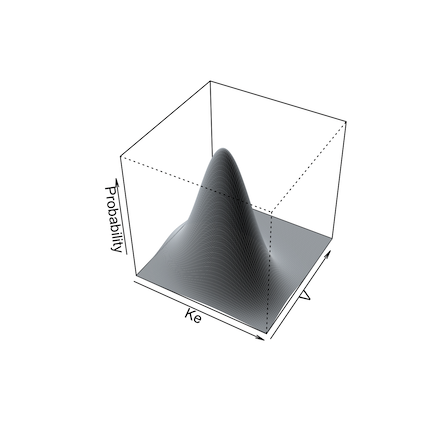
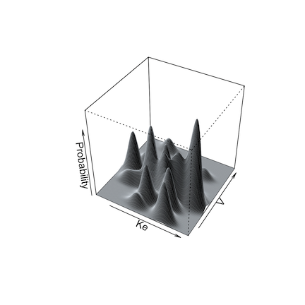

```{r}
#| label: setup
#| echo: false
#| message: false
#| eval: true
library(glue)
library(knitr)
library(Pmetrics)


knitr::opts_chunk$set(
  collapse = TRUE,
  comment = "#>", 
  echo = TRUE,
  eval = FALSE
)


pmetrics <- function(){
    knitr::asis_output("[Pmetrics]{style=\"color: #841010; font-family: 'Arial', Arial, sans-serif; font-weight: 900;\"}")
}


r_help <- function(pkg, name, fn = NULL) {
    if(is.null(fn)) {fn <- name}
    glue::glue("[`{name}`](https://rdrr.io/pkg/{pkg}/man/{fn}.html)")
}

gh_help <- function(name) {
    glue::glue("[`{name}`](https://lapkb.github.io/Pmetrics/reference/{name}.html)")
}

exData <- PM_data$new(data = "Data/src/ex.csv")
mod1 <- PM_model$new("Data/src/model.txt")
run2 <- PM_load(run = 2, path = "Data/Runs")

```

## Introduction to simulations

The `r pmetrics()` simulator is a powerful Monte Carlo engine that is smoothly integrated with Pmetrics inputs and outputs.

The simulator needs **3 mandatory inputs**:

1.  *Data*, which serves as the template providing inputs (e.g. doses) and outputs (e.g. concentrations)
2.  *Model*, which provides the equations
3.  *Joint probability value distributions for the parameters in the model*, i.e., the prior distribution from which to sample parameter values

There are **two ways to call the simulator**, which we discuss in more detail below.

1.  Use the `$sim()` method with a `r gh_help("PM_result")` object, e.g. `run1 <- PM_load(1); sim1 <- run1$sim(...)`
2.  Use `r gh_help("PM_sim")` directly, e.g. `sim2 <- PM_sim$new(...)`

Whether you use `PM_result$sim()` or `PM_sim$new()`, unlike the prior versions of `r pmetrics()`, you do not need to read the simulator output files with `SIMparse`; `r pmetrics()` does that for you automatically and returns the `PM_sim` object.

## Simulator input details

### Data

The data template for a simulation is a `r gh_help("PM_data")` object, with exactly the same structure as used for fitting models. This template contains the dosing and observation history as well as any covariates for each subject to be simulated. Each subject in the data template will serve as a template for `nsim` simulated profiles. You can supply the `PM_data` object in a number of ways.

-   Use a previously created `PM_data` object, usually from an appropriate file with `PM_data$new("filename")` but could be created with the `$addEvent()` method (see [data](data.html) for details) or by creating an appropriate data frame in R and passing it to `PM_data$new()`.
-   Provide the name of an appropriate data file with path if needed. Use `r r_help("base", "getwd")` and `r r_help("base", "list.files")` to ensure the path and filename are correct.
-   If using `PM_result$sim()`, omit the `data` argument to use the data in the `PM_result` as the template.

When simulating, observation values (the `OUT` column) for `EVID=0` events in the template can take any value, which will be replaced with the simulated values. This includes observations coded as missing, `OUT = -99`, or censored, `CENS = 1` or `CENS = -1`. Such scenarios are only expected if using the data from a `PM_result`,method 1 above to call the simulator. When making a new template, a good choice is `OUT = -1` to remind you that it is being simulated, but this value is optional.

You can have any number of subject records within a data template, each with its own doses, dose times, observation times, and covariate values if applicable. Each subject will generate as many simulated profiles as you specify. You can control which subjects in the template are used and how many are simulated with the `include`, `exclude`, and `nsim` arguments to the simulator (see below). The first two arguments specify which subjects in the data object will serve as templates for simulation. The second specifies how many profiles are to be generated from each included subject.


### Model

Analogous to the data template, the model for a simulation is a `r gh_help("PM_model")` object, with exactly the same structure as used for fitting. You can supply the `PM_model` object in a number of ways.

-   Use a previously created `PM_model` object, either by defining a model list directly in R  (see [models](models.html) for details) passing it to `PM_model$new()`, or from an appropriate file with `PM_model$new("filename")`.
-   Provide the name of an appropriate model file with path if needed. Use `r r_help("base", "getwd")` and `r r_help("base", "list.files")` to ensure the path and filename are correct.
-   If using `PM_result$sim()`, omit the `model` argument to use the model in the `PM_result` as the template.

The model primary (random) parameters must match the parameters in the `poppar` argument (see below). Any covariates in model equations must be included in the data template. 

### Population parameter distribution

The last mandatory item is a prior probability distribution for all random parameter values in the model. `r pmetrics()` draws samples from this distribution to create the simulated output. You can supply the `poppar` prior object with the population parameters in a number of ways.

-   Use a previously created `r gh_help("PM_final")` object which is a field in a `PM_result` object, e.g. `run1 <- PM_load(1); poppar <- run1$final`.
-   If using `PM_result$sim()`, omit the `poppar` argument to use the `PM_final` object in the `PM_result`.
-   Create a `poppar` list directly in R, which is detailed below.
-   Supply a data frame with number of rows equal to the number of simulations desired and columns with values for each parameter in the model 

#### Details on manually specifying `poppar`

This is a flexible but somewhat complex means of creating a prior without a previous Pmetrics fit. It is suitable for lifting priors from published models or other sources. A manually specified prior as a list containing the following named items:

* **wt** vector of weights (probabilities) of sampling from each distribution. If missing, assumed to be 1. If only one distribution is to be specified the`wt` vector can be omitted or should be `wt = 1`. If multiple distributions are to be sampled, the `wt` vector should be of length equal to the number of distributions in `mean` and the values of `wt` should sum to 1, e.g. `wt = c(0.25, 0.05, 0.7)`. 
* **mean** a list of mean parameter values. Each element of the list should be named with the parameter name and be a vector of length equal to the number of distributions.
* **sd** an optional named list of overall standard deviations for each parameter, considering parameters as unimodally distributed, i.e. there should only be one value for each parameter, regardless of the number of distributions. `sd` is only needed if a correlation matrix is specified, which will be converted to a covariance matrix. 
* **ONE** of the following matrices:
  1. **cor** A square matrix of the overall correlations between parameters, again considered as unimodally distributed, i.e. there should only be one correlation matrix regardless of the number of distributions. If a correlation matrix is specified, the `sd` element is required to calculate the covariance matrix.
  2. **cov** A square matrix of the overall covariances between parameters, again considered as unimodally distributed, i.e. there should only be one covariance matrix regardless of the number of distributions. If a covariance matrix is specified, the `sd` element is unnecessary, since the diagonals of the covariance matrix are the variances or squared standard deviations. The covariance matrix, whether specified as `cov` or as a combination of `cor` and `sd`, will be divided by the number of distributions, i.e. `length(wt)`, and applied to each distribution.

**Examples** of manually specifying `poppar`:

* Single distribution: 

  ```{r}
  #| label: sim1
  #| eval: FALSE
    poppar = list(wt = 1, 
              mean = list(ke = 0.5, v = 100), 
              cov = matrix(c(0.04, 2.4, 2.8, 400), nrow = 2))  
             
  ```
**Notes:** Here, `sd` is not required because `cov` was specified. 

* Multiple distributions: 
  ```{r}
  #| label: sim2
  #| eval: FALSE
    poppar = list(wt = c(0.1, 0.15, 0.75), # 3 distributions that sum to 1
              mean = list(ke = c(2, 0.5, 1), v = c(50, 100, 200)), # 3 values for each parameter
              sd = list(ke = 0.2, v = 20), # overall sd, ignoring multiple distributions
              cor = matrix(c(1, 0.6, 0.7, 1), nrow = 2)) 
              # sd required because cor specified
  ```
**Notes:**

## Details on running the simulator

You run the simulator in two ways.

-   Use the `$sim()` method for `PM_result()` objects. This takes `poppar` from the `PM_result$final` field and the model from the `PM_result$model` field, so only a data object needs to be specified at minimum. If no data object is specified, it will use the `PM_result$data` as a template, i.e. the same data used to fit the model. An example is below. You don't have to supply the model or `poppar`, because they are included in `run1`, with `poppar` taken from the `run$final` field. Supplying a different `PM_data` object as `dat` allows you to use the model and population prior from `run1` with a different dosing and observation data template. If you omit `dat` in this example, the original data in `run1` would serve as the template.

```{r echo = TRUE, eval = FALSE, label = sim3}
run1 <- PM_load(1)
sim1 <- run1$sim(data = dat, nsim = 100, limits = NA)
```

-   Use `PM_sim$new()`. This simulates without necessarily having completed a fitting run previously, i.e., there may be no `PM_result()` object. Here, you manually specify values for `poppar`, `model`, and `data`. These can be other `r pmetrics()` objects, or de novo, which can be useful for simulating from models reported in the literature. An example is below.

```{r echo = TRUE, eval = FALSE, label = sim4}
sim2 <- PM_sim$new(poppar = run2$final, data = dat, model = mod1, ...)
```

Now you must include all three of the mandatory arguments: `model`, `data`, and `poppar`. In this case we used the `PM_final()` object from a different run (`run2`) as the `poppar`, but we could also specify `poppar` as a list, for example. See `SIMrun()` for details on constructing a manual `poppar`.

```{r echo = TRUE, eval = FALSE, label = sim5}
poppar <- list(wt = 1, mean = c(0.7, 100), covar = diag(c(0.25, 900)))
```

Under the hood, both of these calls to the simulator use the Legacy `SIMrun()` function, and thus all its arguments are available when using `PM_result$sim(...)` or `PM_sim$new(...)`.

## Simulation options

Details of all arguments available to modify simulations are available by typing `?PM_sim` into the R console and clicking the link for the `$new()` method. A few are highlighted here.

Simulation from a non-parametric prior distribution (from NPAG) can be done in one of two ways. The first is simply to take the mean and covariance matrix of the distribution and perform a standard Monte Carlo simulation. This is accomplished by setting `split = FALSE` as an argument.

The second way is what we call semi-parametric [@goutelle_nonparametric_2022]. In this method, the non-parametric "support points" in the population model, each a vector of one value for each parameter in the model and the associated probability of that set of parameter values, serve as the mean of one multi-variate normal distribution in a multi-modal, multi-variate joint distribution. The weight of each multi-variate distribution is equal to the probability of the point. The overall population covariance matrix is divided by the number of support points and applied to each distribution for sampling.

Below are illustrations of simulations with a single mean and covariance for two parameters (left, `split = FALSE`), and with multi-modal sampling (right, `split = TRUE`).

 

Limits may be specified for truncated parameter ranges to avoid extreme or inappropriately negative values. The simulator will report values for the total number of simulated profiles needed to generate `nsim` profiles within the specified limits, as well as the means and standard deviations of the simulated parameters to check for simulator accuracy.

Output from the simulator can be controlled by further arguments passed to `PM_result$sim()` or `PM_sim$new()`. If `makecsv` is supplied, a .csv file with the simulated profiles will be created with the name as specified by `makecsv`; otherwise, there will be no .csv file created. 

## Simulation output

As of version 2.0, simulation output is returned as the new `PM_sim()` object that was assigned to contain the results of the simulation. There are no files written to the hard drive. You no longer need to use the Legacy function `SIMparse()`. 

If you simulated from a template with multiple subjects, your simulation contains output from each template as an `id` column, and each `id` will have `nsim` profiles. 

`PM_sim()` objects have 6 data fields and 6 methods.

### Data fields

Data fields are accessed with `$`, e.g. `sim1$obs`.

-   **amt** A data frame with the amount of drug in each compartment for each template subject at each time.
-   **obs** A data frame with the simulated observations for each subject, time and output equation.
-   **parValues** A data frame with the simulated parameter values for each subject.
-   **totalCov** The covariance matrix of all simulated parameter values, including those that were discarded to be within any `limits` specified.
-   **totalMeans** The means of all simulated parameter values, including those that were discarded to be within any `limits` specified.
-   **totalSets** The number of simulated sets of parameter values, including those that were discarded to be within any `limits` specified. This number will always be ≥ `nsim`.

All of these are detailed further in `r gh_help("PM_sim")`.

### Methods

Methods are accessed with `$` and include parentheses to indicate a function, possibly with arguments e.g. `sim1$auc()` or `sim1$save("sim1.rds")`.

-   **auc** Call `r gh_help("makeAUC")` to calculate the area under the curve from the simulated data.
-   **pta** Call `r gh_help("PM_pta")` to perform a probability of target attainment analysis with the simulated data.
-   **plot** Call `r gh_help("plot.PM_sim")` to plot the simulated data.
-   **summary** Call `r gh_help("summary.PM_sim")` to summarize any data field with or without grouping.
-   **save** Save the simulation to your hard drive as an .rds file. Load a previous one by providing the filename as the argument to `PM_sim$new()`.

All of these are detailed further in `r gh_help("PM_sim")`.To apply them to one of the simulations when there are multiple, use `at` followed by additional arguments to the method to choose the simulation.

```{r echo = TRUE, eval = FALSE, label = sim7}
sim1$plot(include = 2, ...)
```

## Set up the tutorial environment

:::{.callout-tip}
Make sure you have run the [tutorial setup code](index.qmd#tutorial-setup) in your R session before copying, pasting and running example code here.
:::

## Basic simulation

The following will simulate 100 sets of parameters/concentrations using the model, population parameter values,
first subject in the data all attached to `run1` (exercise on [first NPAG run](NPAG.qmd)).

Setting `limits = NA` makes the simulated parameter values stay within the same ranges as in the model for `run1`.

```{r}
#| eval: true
simdata <- run2$sim(include = 1, limits = c(0,3), nsim = 100)
```

Below is the alternate way to simulate, which is particularly useful if you define 
your own population parameters. See `?PM_sim` for details on this as well as
the article on simulation.

```{r}
#| eval: true

# define population parameters for simulation
poppar <- list(
  mean = list(ka = 0.6, ke = 0.05, v = 77.8, lag1 = 1.2),
  cov = diag(c(0.07, 0.0004, 830, 0.45))
)

# now we need to provide parameter value distributions (poppar), data, and model
simOther <- PM_sim$new(poppar = poppar, data = exData, model = mod1,
                       include = 1, limits = NA, nsim = 100)
```

Simulate from a model with new data.

```{r}
#| eval: true
sim_new <- run2$sim(
  data = "Data/src/ptaex1.csv",
  include = 2, limits = NA,
  predInt = c(120, 144, 1)
)
```


Plot them; `?plot.PM_sim` for help.

```{r}
simdata$plot()
simOther$plot() 
sim_new$plot(log = FALSE) 
```

```{r}
#| eval: true
plotly::plotly_build(simdata$plot())
plotly::plotly_build(simOther$plot()) 
plotly::plotly_build(sim_new$plot(log = FALSE))
```

Simulate using multiple subjects as templates.

```{r}
#| eval: true
simdata <- run2$sim(include = 1:4, limits = NA, nsim = 100)
```

Plot the third simulation; use include/exclude to specify the ID numbers, which are the same as the ID numbers in the template data file


```{r}
simdata$plot(include = 3) # one regimen
simdata$plot(exclude = 3) # all but one regimen; notice the jagged profiles arising from combining different regimens
```


```{r}
#| eval: true
plotly::plotly_build(simdata$plot(include = 3)) # one regimen
plotly::plotly_build(simdata$plot(exclude = 3)) # all but one regimen; notice the jagged profiles arising from combining different regimens
```

## Simulate with covariates
In this case we use the covariate-parameter correlations from run 2, which are found in the `cov` field. We re-define the mean weight to be 50 with SD of 20, and limits of 10 to 70 kg.  We fix africa, gender and height covariates, but allow age (the last covariate) to be simulated, using the mean, sd, and limits in the original population, since we didn't specify them. See ?SIMrun for more help on this.

```{r}
#| eval: true
covariate <- list(
  cov = run2$cov,
  mean = list(wt = 50),
  sd = list(wt = 20),
  limits = list(wt = c(10, 70)),
  fix = c("africa", "gender", "height")
)
```


Now simulate with this covariate list object.

```{r}
#| eval: true
simdata3 <- run2$sim(include = 1:4, limits = NA, nsim = 100, covariate = covariate)

```

There are subtle differences between simulations with and without covariates simulated, all other inputs the same.

```{r}
simdata$plot(include = 4)  # without covariates
simdata3$plot(include = 4) # ...and with covariates simulated
```

```{r}
#| eval: true
plotly::plotly_build(simdata$plot(include = 4))  # without covariates
plotly::plotly_build(simdata3$plot(include = 4)) # ...and with covariates simulated
```

Here are the simulated parameters and covariates for the first subject's
template; note that both wt and age are simulated, using proper covariances
with simulated PK parameters.

```{r}
#| eval: true
simdata3$data$parValues
```

We can summarize simulations too. See `?summary.PM_sim` for help.

```{r}
#| eval: true
simdata3$summary(field = "obs", include = 3)
```

Next, we'll see the first of two applications of simulation: Probability of Target Attainment (PTA).


## Citations